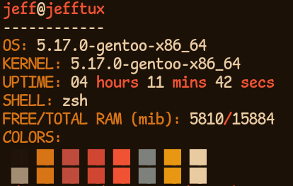

# TFetch

This is a simple fetching application that is light weight and fast (as it is written in the programming language c).

## Install

### PreCompiled Binaries

Just use the github releases found on the right hand side

### From Source

```console
git clone https://github.com/Thamognya/TFetch.git

cd TFetch

make

sudo make doc

sudo make install
```

### Package Manager

Coming soon.

## Usage

```console
tfetch
```

## Pictures



## Uninstall

### PreCompiled Binaries

Remove it from the location you have kept the binary in

### From source

```console
sudo make unintsall
```

### Package Manager

Uninstall it via the package manager

# Contributing and TODO

## TODO

- Full MacOS support
- Logo support for all linux distributions
- Package manager support for all linux distributions
- Docker to work
- config file

## Contributing

via PRs or issues are fine

- Fixing any of the TODO
- New features
- Fixing any bugs

# Author

This program is written by Thamognya Kodi. You can help me by just liking this repo if you would like.

# Sources used 

preprocessing directives:
- https://sourceforge.net/p/predef/wiki/OperatingSystems/
Library-list (apart from <stdio.h>):
- <unistd.h>
- <limits.h>
- <stdlib.h>
- <sys/sysinfo.h>

# Contributing working on this

To start contributing, to have a consistent environment you can use the `docker-compose up -d` and then 

# License

`SPDX-License-Identifier: AGPL-3.0-or-later`

The following licenses are present in the licenses folder.

If you are going to use my code without my permission by forking it, you must follow the AGPL-3.0-or-later licenses.
